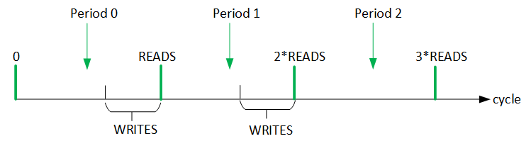
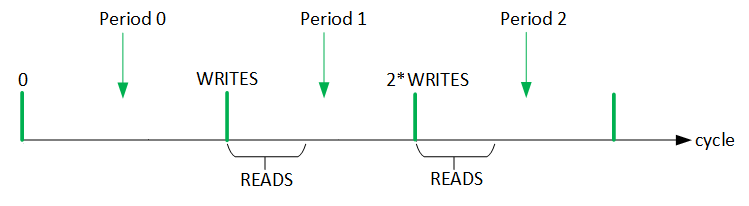

# Design for Data Buffering

By Hongbo Rong (hongbo.rong@intel.com),  Mingzhe Zhang (zmz21@mails.tsinghua.edu.cn), Yi-Hsiang Lai (yl2666@cornell.edu), Xiuping Cui (cuixiuping@pku.edu.cn)


## Overall

* Invoking format   

  ```C++
  B.buffer(Func A, VarOrRVar buffer_loop, BufferStrategy strategy)
  ```

* Constraints:

  * Usually, the producer and consumer have exactly the same loop structure: the same set of loops in the same order, and every loop has the same ForType in both the producer and the consumer. However, the producer can have less loops due to loop removal before.
* The producer communicates with the consumer with channels.
  
  * The communication has no condition, or if there is any condition, the condition must be like `some loop == loop_min`.
* Only double buffer is supported now

## The work scheme of a double buffer

A double buffer consists of a write buffer, which is written `WRITES` number of times to be full, and a read buffer, which is read `READS` number of times to be empty. We requires `READS - WRITES >= 0`. The bigger the difference, the less the workload is bound by memory.

With every `READS` cycles as a period, a double buffer works as shown below:



Although not shown in the scheme, in the first period, there are only writes; in the last period, there are only reads.

## Double buffers plus scattering

With scattering, a single producer PE sends data to one of the `n` consumer PEs, and each consumer PE has its own double buffer. So there are `n` double buffers. All the data to be written to the `n` write buffers are sent to that one consumer PE, which broadcast the data to all the other PEs, and each PE chooses the data belonged to them.

In general, `WRITES` is the total number of data the producer sends in 1 period (via the channel and eventually into the `n` write buffers), and `READS` is the total  number of data read by 1 consumer PE from its own read buffer in 1 period (Note that each of the `n` consumer PEs reads data from its own read buffer in parallel). So `WRITES` should be counted by the producer's loops, and `READS` should be counted by the consumer's loops. 

Define `WRITE_LOOPS` as the set of loops whose extents' product determines `WRITES`. These loops are the **serial loops in the producer below the buffer insertion point**. Of course, removed, unrolled and vectorized loops in the producer are skipped. Note that the scatter loop  in the producer will be changed from unrolled to serial after scattering, and thus should be counted. **Unless the scatter loop has been removed in the producer, the scatter loop is a write loop, and must be at the innermost level**. So the producer sends data in this order: 1 datum for the first consumer PE, 1 datum for the second consumer PE, ..... 1 datum for the last consumer PE; repeat this order .

Similarly, define `READ_LOOPS` as the set of loops whose extents' product determines READS. These loops are the **serial loops in the consumer below the buffer insertion point**. Of course, removed loops, unrolled loops (including the scatter loop) and vectorized loops in the consumer are skipped.

## Code pattern for double buffers with scattering (`READS`>=`WIRTES`)

```
__kernel void my_kernel()
{
    // Define these macros according to your loop nest
    #define TYPE         data type
    #define WRITE_LOOPS  serial loops in the producer below the buffer insertion point
    #define READ_LOOPS   serial loops in the consumer below the buffer insertion point
    #define WRITES       product of the extents of WRITE_LOOPS
    #define READS        product of the extents of READ_LOOPS
    #define BUFFERS      number of double buffers (i.e. extent of the scatter loop)
    #define BUFSIZE      size of a single read or write buffer (i.e. product of the extents of WRITE_LOOPS except the scatter loop)
    #define PERIODS      number of periods for a single read buffer (i.e. product of the extents of the loops in the consumer above the buffer insertion point)
    #define IN_CHANNEL   input channel name (assume a single input channel has been declared before)
    #define OUT_CHANNEL  output channel array's name (assume BUFFERS number of output channels have been declared before)
    #define READ_FROM(t) address to read from a single read buffer, given the current time offset t in a period

    // No need to modify below
    
    #define INIT        (READS - WRITES)
    #define WRITE_TO(t) ((t - INIT) / BUFFERS) // address to write to a single write buffer, given the current time offset t in a period.
    #define BANKS       power of 2 closest to BUFFERS
    
    TYPE __attribute__((memory, numbanks(BANKS), singlepump, numwriteports(1), numreadports(1))) DB[2][BUFSIZE][BANKS];
    
    // We assume synchronous code, and therefore, space (i.e. unrolled) loops must be at the innermost levels
    // A vectorized loop can be at the very innermost level, but it is considered to be vectorized away and does not 
    // exist: it would affect only TYPE). Thus the incoming data are evenly scattered to the write buffers one by one.
    TYPE value[BUFFERS];
    int  time_stamp[BUFFERS];
    
    int  cycle = INIT; // Current cycle
    TYPE in_v;
    #pragma ivdep safelen(WRITES) // No memory dependence until after WRITES cycles.
    while(1) {
         // Get input
         int period = cycle / READS; // current period
         int offset = cycle % READS; // relative position of the current cycle in the current period
         bool time_to_write_buffer = (offset >= INIT); 
         if ((period < PERIODS) && time_to_write_buffer) {
             in_v = read_channel_intel(IN_CHANNEL); 
         }

         // Broadcast in_v across the PES, and send buffered data to the systolic array
         #pragma unroll
         for (int buf = 0; buf < BUFFERS; buf++) {
             // Broadcast in_v by scattering. Time stamp in_v so that we know when v was got from the input channel.
             if (buf == 0) {
                 value[0] = in_v;
                 time_stamp[0] = cycle;
             } else {
                 value[buf] = value[buf-1];
                 time_stamp[buf] = time_stamp[buf-1];
             }

             // Write buffer
             int  _cycle = time_stamp[buf]; // the cycle when value[buf] was read from the input channel 
             int  _period = _cycle / READS;
             int  _offset = _cycle % READS;
             bool _time_to_write_buffer = (_offset >= INIT);
             int _owner = (_cycle / READS * WRITES + _offset - INIT) % BUFFERS;	// buffer that should own value[buf]
             bool _idx = _period & 1; // DB[0] and DB[1] are written alterantively in the periods  
             if (buf == _owner && _time_to_write_buffer) {
                DB[_idx][WRITE_TO(_offset)][buf] = value[buf];
             }

             // Read buffer
             bool _time_to_read = _period > 0; 
             if (_time_to_read) {
                write_channel_intel(OUT_CHANNEL[buf], DB[!_idx][READ_FROM(_offset)][buf]);
             }
        }
        cycle++;
    }
    
    #undef WRITES
    #undef INIT
    #undef WRITE_TO
    #undef BANKS
    #undef TYPE
    #undef BUFFERS
    #undef BUFSIZE
    #undef READS  
    #undef PERIODS
    #undef IN_CHANNEL
    #undef OUT_CHANNEL
    #undef READ_FROM
}
```
You can copy the above code pattern, and replace the macros as needed. For example, suppose we have the following loop nest shared by a loader that has 1 PE, and a feeder that has multiple PEs:

```
    for oi, oj, ok, kk
      insert a double buffer in every feeder PE here
      for iii (removed in the loader)
        for jjj
          unroll for ii (always equal to 0 in the loader, so extent is 1)
            (unroll) for jj (scattering along this dimension through the feeder PEs)
              vectorize for kkk (vectorized away)
```
We mark the `jj` loop as `(unroll)`: this loop must be changed to be sequential in the loader, but it must be unrolled in the feeder. In this way, the compiler ensures that the loader has only 1 PE, but the feeder has multiple PEs.

Then we just copy the above code, and define the macros as follows:

```
    #define TYPE         float16 // assume KKK = 16 and data is floating-point
    #define WRITE_LOOPS  {jjj, jj}
    #define READ_LOOPS   {iii, jjj}
    #define WRITES       JJJ * JJ
    #define READS        III * JJJ
    #define BUFFERS      JJ
    #define BUFSIZE      JJJ
    #define PERIODS      (OI * OJ * OK * KK)
     
    #define IN_CHANNEL   loader_channel // suppose you have declared the channel before
    #define OUT_CHANNEL  feeder_channel // suppose you have declared the channels before
    #define READ_FROM(t) (t % JJJ) // Below the buffer insertion point, without counting removed, unrolled and vectorized loops, the loops (here just jjj loop) determine where to read.
```

For another example, suppose the loop nest is like this:

```
    for oi, oj, ok, kk, iii
      insert a double buffer in every feeder PE here
      for jjj (removed in the loader)
        (unroll) for ii (scattering along this dimension through the feeder PEs)
          unroll for jj (always equal to 0, so extent is 1)
            vectorize for kkk (vectorized away)
```

Then we just copy the above code, and modify the macros as follows:

```
    #define TYPE         float16 // assume KKK = 16 and data is floating-point.   
    #define WRITE_LOOPS  {ii}
    #define READ_LOOPS   {jjj}
    #define WRITES       II
    #define READS        JJJ
    #define BUFFERS      II
    #define BUFSIZE      1 // No loops in this example, and thus 1.
    #define PERIODS      (OI * OJ * OK * KK * III)        
    #define IN_CHANNEL   loader_channel // suppose you have declared the channel before
    #define OUT_CHANNEL  feeder_channel // suppose you have declared the channels before
    #define READ_FROM(t) 0 // BUFSIZE is 1, so always read from location 0
```


## Modified code pattern(`READS`<`WIRTES` supported)

We requires `READS`>`=WRITES` in previous code pattern. If the condition is not satisfied, the code will generate a wrong answer due to the miscalculation of period and some wrong conditions. Therefore, we need to modify part of the code pattern as follows: 

```
__kernel void my_kernel()
{
	#define	CYCLE_PER_PERIOD	max(READS, WRITES)	// The total cycles of a period is determined by the bigger one rather than READS only
	#define	INIT	max(READS-WRITES, 0)	// If READS < WRITES, buffers are written at the beginning of each period
	#define WRITE_TO(t) ((t - INIT) / BUFFERS) // address to write to a single write buffer, given the current time offset t in a period
	......
	while(1) {
         // Get input
         int period = cycle / CYCLE_PER_PERIOD; // current period
         int offset = cycle % CYCLE_PER_PERIOD; // relative position of the current cycle in the current period
         ......
         
		// Write buffer
         int  _cycle = time_stamp[buf]; // the cycle when value[buf] was read from the input channel 
         int  _period = _cycle / CYCLE_PER_PERIOD;
         int  _offset = _cycle % CYCLE_PER_PERIOD;
		......

        // Read buffer
        bool _time_to_read = _period > 0 && _offset < READS;	// stop reading buffer when _offset >= READS, because the buffer is empty
		......
    }
	......
}
```

When `READS >= WRITES`, this modified code pattern won't change the scheme. As the condition `READS< WRITES`, the double buffer works with every `WRITES` cycles as a period: 



## Possible improvements to the code pattern

First, in the code pattern, we have used `while (1)` infinite loop. In order to be able to use this infinite loop, `PERIODS` must be a static constant. If not, we cannot use infinite loop. Instead, we can have two alternatives:

(1) We can isolate out `PERIODS` (or the condition `period < PERIODS`) to the producer function, and let that producer to send it in through a channel.

(2) We can also make a minor change to the code pattern as below: 

```
    for(int period = 0; period < PERIODS + 1; period++) {
      for (int offset = 0; offset < CYCLE_PER_PERIOD; offset++) {
       ...
      }
    }
````

Second, in the code pattern, the buffer writes and buffer reads are governed by the same clock. We use `read_channel_intel(IN_CHANNEL)` for the write buffer. This is a synchronous channel read, and thus if there is no datum in the input channel, the process will be stalled until the input channel has data. But reading the input channel is only to fill a write buffer, why should the read buffer access is blocked?

We can avoid this situation by the following:

(1) Use two different clocks for buffer writes and buffer reads.

(2) Access `IN_CHANNEL` and/or `OUT_CHANNEL` asynchronously. A clock increments only when an access to the corresponding channel succeeds.

(3) Synchronize the two clocks like this:

```
    if (read clock reaches its max) && (write clock reaches its max) {
       period++
       read clock = 0
       write clock = INIT
    }
```

Third, our code generation pattern contains a variable `cycle` that increments in one loop iteration to be used by the next iteration. This create a loop-carried dependence that might affect II. If II is limited by it, consider implement the following optimization in the code pattern. That is, pre-calculate several values of `cycle` for several iterations before the loop, and increment them in the loop. For example, we may set `cycle` for three iterations:

```
c[0] = 0, c[1] = 1
while (1) {
	cycle = c[0];
	c[0] = c[1]; c[1]++
	... // work as ususal
}
```

## Separate buffers for multiple incoming data

If the producer sends multiple different types of data (e. g. data and control signals) every time to the consumer, the producer would pack the data into a struct, and send the struct to the consumer. Each  consumer PE has a double buffer, where every element is a struct. 

However, the fields in a struct might have different reuse patterns. For example, a data field might change every cycle, a control signal field might change every period. Therefore, to minimize the memory allocation size, each consumer PE should have a separate double buffer for every field, and the double buffer's size should be determined by the corresponding field's reuse pattern.

Define `REUSE_WRITE_LOOPS`  for a datum as the subset of `WRITE_LOOPS` whose loop variables are not referenced by the datum. For example, if the datum is `a[i, k]`, and the `WRITE_LOOPS` is `{i, j, k}`, then the `REUSE_WRITE_LOOPS`  for  the datum is `{j}`. Without minimizing memory allocation, the buffer allocated for the datum would be `[I][J][K]`, and when we write to the buffer location `OFFSET`, the  `OFFSET=i*J*K + j*K + k`. To minimize memory allocation, we should let `WRITE_LOOPS - REUSE_WRITE_LOOPS = {i, k}` determine the buffer size: the buffer allocated for the datum should be `[I][K]`, and for `OFFSET = i*J*K + j*K + k`, we should find a buffer allocation `OFFSET' = i*K + k` to write instead. In order to do that, we can find `k = OFFSET % K` first, then `j = (OFFSET / K) % J`,  `i = (OFFSET / K / J)`,  and finally `OFFSET' = i*K + k` .  There are fast algorithms to compute division and remainder for natural numbers (See https://graphics.stanford.edu/~seander/bithacks.html#ModulusDivisionEasy)  

When the scatter loop is not removed in the producer, the scatter loop must be the innermost write loop. Thus in the previous code pattern, `_owner= _cycle % BUFFERS` is computing the scatter loop index. We just need to compute the other write loops' index as well, and find out the new `OFFSET'` to write to a buffer.

When the scatter loop is removed in the producer, the scatter loop is not a write loop. We need to replace the condition `_idx == _owner` with `true` (so that 1 datum is owned by and written into all the `n` buffers), and compute all the write loops' index to find out the new `OFFSET'` to write to a buffer.

