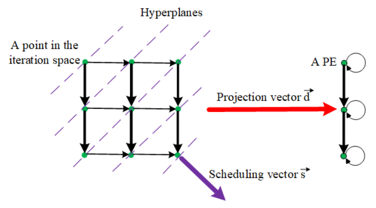
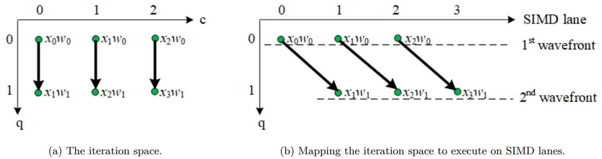

# Multi-projection

By Xiaochen Hao (xiaochen.hao@stu.pku.edu.cn)

The space-time transform technique implemented in the current t2s compiler gives the programmer a systematic methodology to transform an algorithm represented in high-level specifications into a systolic architecture. However, it lacks enough freedom to specify projection direction and general support of multi-projection. We expect to bridge this gap by introducing a new stt interface.

## Concept

There are two primary considerations for mapping from a dependence graph to a systolic array architecture:
- To which processors should operations be assigned?  
A linear projection is often represented by a projection vector `d` as illustrated in the following figure. The nodes along the projection vector will be mapped into the same PE. To determine the assigned processors, we compute an allocation matrix (also called a projection matrix) `P` that is orthogonal to `d`. Then any node `z` in the original iteration space will be mapped to a processor whose index equals `Pz`.
- In what order should the operations be assigned to a processor?  
A linear schedule is a set of parallel and uniformly spaced hyperplanes in the dependence graph. All the nodes on the same hyperplane can be processed in parallel. The schedule can be represented by a schedule vector `s`, pointing to the normal direction of the hyperplanes.



## Semantics



Let us take one-dimensional convolution as an example. The above figure illustrates an idea of how to compute 1-D convolution in a systolic array. (a) shows the original iteration space, and (b) shows how the iteration space is mapped to execute on 4 PEs, which are 4 SIMD lanes in this example. The nodes with the same `c+q` values are mapped to the same PE. Thus the projection matrix is [1, 1], and the projection vector is (-1, 1).

So, we get the following specification:

```
1.  Z(q, c) = select(q == 0, 0, Z(q - 1, c)) + x(c + q) * w(q); // Recurrent calculation.
2.  out(c) = select(q == Q - 1, Z(q, c)); // Final result
3.  Z.space_time_transform({c, q},     // the source loops to transform
4.                         {k, t},     // the destination loops
5.                         {1, 1,      // allocation: space loop k = c + q
6.                          0, 1},     // scheduling vector: time loop t = q
7.                         {q, t,      // reverse transform: q = t
8.                          c, k - q}, // reverse transform: c = k - q
9.                         SpaceTimeTransform::NoCheckTime 
10.                       );
```

## Implementation
Let us see how to modify the IR node to adapt to the new stt interface.
### Front-end
We need to save the scheduling vector and allocation matrix into `params.sch_vector` and `params.proj_matrix` correspondingly.
### Produce
In the corresponding visitor function, we collect the loop information, such as the loop's var, min, and extent.
### For
We need to build space loops and time loops. For time loops, we need to calculate their bounds and add shift register logic. For space loops, the projection vector affects the loop bounds and register size. Take the 1d-conv as an example, the original loops are:
```
int Z[Q][C];
for (q = 0, Q)
  for (c = 0, C)
    Z[q][c] = (q == 0 ? 0 : Z[q-1][c]) + x(c+q) * w(q);
```
After visiting the space loop, loop `q` becomes time loop `t`, and loop `c` becomes space loop `k`:
```
int Z[Q+C][...];
for (t = 0, Q)
  for (k = 0, Q+C)
    ...
```
In general, the extents of the space loop can be computed as:
```
size_t size = params.proj_matrix[for_loop].size();
for (size_t i = 0; i < size; i++) {
   // TODO: proj_matrix < 0
    min += params.proj_matrix[for_loop][i] * loop_mins[size-i-1];
    extent += params.proj_matrix[for_loop][i] * (loop_extents[size-i-1]-1);
}
```
Then, we need to add check time:
```
int Z[Q+C][...];
for (t = 0, Q)
  for (k = 0, Q+C) {
      q = t
      c = k - q
      if (0<=c<=C)
        ...
  }
```
### Provide
For shift registers, we need calculate indices to them:  
1. Time index: First, calculate a dependence distance; Second, multiply the distance with the scheduling vector. Third, simplify.
3. Flatten the time loops. 
4. Space indices: use the projection matrix `P` and dependence distance to calculate.
5. Update the size of the shift registers by checking the time and space expressions.
Now, we got the following loops:
```
int Z[Q+C][1];
for (t = 0, Q)
  for (k = 0, Q+C) {
      q = t
      c = k - q
      if (0<=c<=C)
        Z[k][(1-t)] = ...
  }
```

### Call
We can apply to a Call node a process similar to that to a Provide node.
We got the following loops:

```
int Z[Q+C][1];
for (t = 0, Q)
  for (k = 0, Q+C) {
      q = t
      c = k - q
      if (0<=c<=C)
        Z[k][(1-t)] = Z[k][0-t] + x(c+q) * w(q)
  }
```
