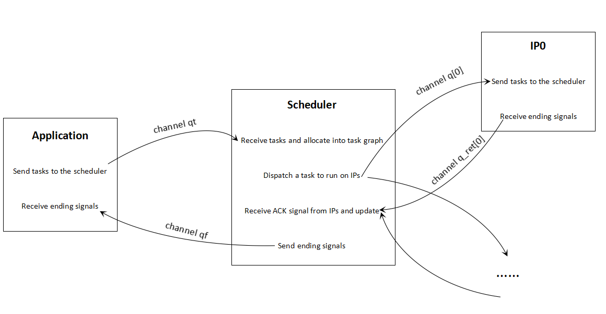

# Design of Overlay

By Mingzhe Zhang  (zmz21@mails.tsinghua.edu.cn), Shaojie Xiang (sx233@cornell.edu)

### Overall



### Application

With code block

```c
Task0(i) = enqueue(overlay, 0, input, output);
Task1(i) = enqueue(overlay, 1, input, output);
Task0.merge_ures(Task1);
Task1.depend(Task0,...);
Task1.realize(...);
```

we expect the following initial IR: 

```c
for  i :        // task loops
    Task0(i) = overlay(0/*task_id*/, 0/*queue*/, input buffer, output buffer)
    Task1(i) = overlay(1/*task_id*/, 1/*queue*/, input buffer, output buffer)
```

`overlay` is an intrinsic call with arguments containing all actual input and output buffers. Then the next pass is  `creating_overlay_schedule`. This pass inserts several intrinsics:

```c++
for  i :    // task loops
    overlay(0/*task_id*/, 0/*queue*/, dependencies, arguments)
    overlay(1/*task_id*/, 1/*queue*/, dependencies, arguments)
overlay_switch("after_main_body")
```

The overlay call in the inner-most loop has new arguments: 

1. auto-increment task id (start from 0)

2. command queue index parameters

3. dependency

   (1) parent task id

   (2) iteration vars

   (3) condition

4. argument assignment map for auto-run kernels (buffer pointers and hidden arguments including min, extent...)

We need to handle intrinsics including `overlay ` and `overlay_switch` in code generation. 

-  `overlay(...)`  creates a task basing on its arguments. 
-  `overlay_switch("after_main_body")` sends the last task to the scheduler with `task.last=true`. As a result, the scheduler won't read tasks through the channel anymore. 

```c
for i /*task loops*/ {
    task_t task;
    task.done = false;
    task.last = false;
    task.queue = 0 /*queue*/
    task.index = {0/*task_id*/, {i}/*current iteration*/}
    index_t dep_0 = {parent_task, {cond ? iter_vars : zeros};
    task.deps[0] = dep_0;
    ...... // other task dependencies
    task.num_of_deps = ...
    task.inputs = {...}
    write_channel_intel(qt, task);    // scheduler will read tasks through channel qt and dispatch them
    mem_fence(CLK_CHANNEL_MEM_FENCE);
    /* Task1 is similar to above...... */
}
task_t task;
task.last = true;
write_channel_intel(qt, task);
mem_fence(CLK_CHANNEL_MEM_FENCE);
```


### Scheduler

Task graph and scheduler are templates and will be generated automatically when detecting overlay in the program. 

Scheduler is an auto-run kernel for scheduling tasks to run on the overlay, respecting the dependences between the tasks. 

```c
__attribute__((max_global_work_dim(0)))
__attribute__((autorun))
__kernel void scheduler() {
    graph_t graph;         
    // create an empty task graph
    graph.slots = 0x0000;
    graph.issue = 0x0000;
    int task_count = 0;
    bool task_not_end = true; 
    while(1) {
        ......
    }
}
```

The while-loop body contains four parts:

- First, read tasks through a channel and allocate the tasks into the task graph

  ```c
  while (task_not_end) {
      if (graph.slots == 0xFFFF) break;     // stop allocating when graph is full
      task_t task = read_channel_intel(qt); // read a task generated by the application 
      if (task.last) 
          task_not_end = false;
      else 
          allocate(&graph, task);
  }
  ```

  

- Second, dispatch pending tasks in the task graph to run on IPs. 

  ```c
  while (1) {
      task_t task;
      bool new_task = dispatch(&graph, &task);     // dispatch the pending tasks
      if (!new_task) break;
      write_channel_intel(q[task.queue], task.inputs);
  }
  ```
  
  For function dispatch, we must find out a valid task with all dependencies satisfied. If there is no such a task, the function will return false.
  
  ```c
  bool dispatch(graph_t* graph, task_t* task) {
    for (int i = 0; i < SIZE; i++) {
        if (!(graph->issue & (1 << i)) && (graph->slots & (1 << i)) && graph->deps[i] == 0x0000) {
              graph->issue |= (1 << i);
              *task = graph->tasks[i]; 
              return true;
        }
    }
    return false;
  } 
  ```
  
  
  
- Third, receive ACK signals from the IPs and update the task graph. 

  ```c
  for (int i = 0; i < #IPs; i++) {
      bool ret_valid = true;
      index_t ret = read_channel_nb_intel(q_ret[i], &ret_valid);    // receive ACK
         while (ret_valid) {
          update(&graph, ret);                                                                          
          // update the graph with ack information 
          ret = read_channel_nb_intel(q_ret[i], &ret_valid);    
      }
  }
  ```
  
  
  
- Forth, send an end signal to the application when all tasks are finished. 

  ```c
  if (!task_not_end && graph.slots == 0x0000) {
      write_channel_intel(qf, task_count);
  }
  ```

  

### Autorun Kernel

Let us take the following example:

```c++
Var i;
A0(i) = A(i) + 1;
A0.command(0, {A}, {}, {}); 
auto overlay = Overlay(A0).compile(target, "overlay");
```

The IR is simple:

```c
for (i, min, extent) {
    A0[(i - min)] = (A[(i - min)] + 1)
}
```

We collect the loop information and replace the loop constant with read-in inputs from a channel. Input arguments like min, extents, strides are passed from `scheduler()` in form of `inputs.constanst[0/1...]`. 

The symbolic arguments (e.g. A) and output buffer (e.g. A0$0) won't be passed into the kernel. `A` will finally be replaced by global pointer `inputs.args0` . We use `allocate ...[....] in CLPtr` to store mutable global pointer passed through the channel. 

```c
while (1) {
    ((void *))overlay_switch("kernel_begin", 0)
    allocate A0[int32 * "inputs.args1"] in CLPtr
    allocate A[int32 * "inputs.args0"] in CLPtr
    let scalar3 = overlay_switch("data", "inputs.constants[2]")
    let scalar2 = overlay_switch("data", "inputs.constants[1]")
    let scalar1 = overlay_switch("data", "inputs.constants[3]")
    let scalar0 = overlay_switch("data", "inputs.constants[2]")
    for (i, scalar0, scalar1) {
        A0[(i - scalar3)] = (A[(i - scalar2)] + 1)
    }
    ((void *))overlay_switch("kernel_end", 0)
}
```

In code generation, intrinsic `overlay_switch` with arguments "kernel_begin" and "kernel_end" adds leading and trailing decoration code block (e.g. `read_channel_intel`/`write_channel_intel`) to the kernel.

At last, all the overlay kernels are compiled to separate OpenCL files:

```c
__attribute__((max_global_work_dim(0)))
__attribute__((autorun))
__kernel void kernel_A0_0_run_on_device() {
    while (1) {
        arg_t inputs = read_channel_intel(q[0]);         // read task inputs
        mem_fence(CLK_CHANNEL_MEM_FENCE);

        int min = inputs.constants[1];
        ......
        for (int i = min; i < min + extent; i++) {
            inputs.args1[...] =  inputs.args0[...] + 1;
        } 
        mem_fence(CLK_CHANNEL_MEM_FENCE);
        write_channel_intel(q_ret[0], inputs.finish);    // send ACK at the end of the kernel
    }
}
```


## Error checking 

For `F.command(queueNo, arguments)`, an error occurs when: 

- specifying programming interface for the same `Func F` more than once.  

  ```c
  F.command(0, arguments);
  F.command(1, arguments);
  ```

- two Funcs have the same command queue index

  ```c
  F1.command(0, arguments);
  F2.command(0, arguments);
  ```

For `enqueue(overlay, queueNo,  arguments)`, an error occurs when: 

- there is a mismatch between symbolic arguments (defined in `command(...)`) and actual input arguments (provided by `enqueue(...)`)

  ```c
  F.command(0,{ A, B}, {}, {});            // There are two symbolic arguments 
  Task(i) = enqueue(overlay, 0, input1);    // User provides only one input
  ```

For `Task.depend(...)`, an error occurs when: 

- there is a circular dependency.

  ```c
  Task1.depend(Task2, i);
  Task2.depend(Task1, i);
  ```

  The scheduler may crash because compiler does not detect this kind of error. Dependencies must be guaranteed by the programmer manually. 