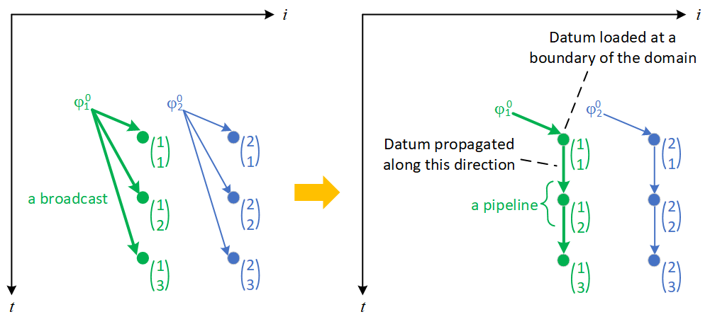

# Rewriting math equations into basic UREs

Based on the work of Gusev and Evans [[1]](#1)[[2]](#2),  we can translate math equations into UREs, following the simple steps below. Going through an example, we would find that this process is pretty much mechanical and intuitive, and only middle-school level of math knowledge is needed. So do not be scared by the math symbols. We strongly recommend a beginner repeats the steps of an example, during which the beginner would quickly master the skills. These skills are applicable to other real world problems, not limited to the examples here.

Use auto-regressive filter for example:

{#Fig:deriving-ures-for-auto-regressive-filter}

figure is here {@Fig:deriving-ures-for-auto-regressive-filter}

{#tbl:deriving-ures-for-auto-regressive-filter}

## Step 1: Iterative form

First, write down the math equations of the original problem. Usually, these equations are to iterate over a domain (like $j=1,..., n$) and compute some variables (like $y_i$).

table @tbl:deriving-ures-for-auto-regressive-filter is here

## Step 2: Recursive form

Translate the iterative form to recursive form is straightforward: figure out the initial value of a variable (e.g. $y_i=x_i$), and update the variable every iteration with a new value based on its previous value (e.g. $y_i=y_i+...$).

## Step 3: DSA (Dynamic Single Assignment)

Every iteration, assign a variable to a distinct memory location. Every writing to a variable (and correspondingly,  every reading of the variable) are indicated by the iteration index. For example, in iteration $j$,  $y_i=y_i+...y_{i-j}$ is changed into  $y_i^j=y_i^{j-1}+...y_{i-j}^n$. After such renaming, the iterations where $y$ are assigned values are clearly exposed. Consequently, the dependences between these iterations are made explicit.  

For another example, the initial condition $y_i=x_i$ is changed into  $y_i^0=x_i$: iteration index $j$ starts from 1 in this example, and therefore,  $y_i^0$ is the $y_i$ before iteration $j$ starts. In general, if iteration index $j$ starts from $s$ and has a step $h$, the initial condition should be $y_i^{s-h}=...$.

## Step 4: Full index form

Now variables are referenced with full indices, but constants are not: $c_j$ and $x_i$ are input values, never modified during the iterations. Give them full indices as well by adding 0's:  $c_j$ and $x_i$ are changed into $c_j^0$ and $x_i^0$. After this, variables and constants will be processed in the same way.

At this point, the equations we get are AREs (Affine Recurrence Equations), that is, every data flow (write after read dependence) has a distance vector in the form of $d=Az+d_0$, where $A$ is a matrix, $z$ is the iteration indices, and $d_0$ is a constant vector:


## Step 5: UREs

We translate AREs into UREs by converting a broadcast into a pipeline. After that, every dependence has a constant distance uniformly in the entire domain.

There are two ways to convert a broadcast into a pipeline. First, we can draw the dataflow and intuitively change a broadcast into a pipeline. Say $n=3$. We can draw the dataflow for the second dependence, as shown below to the left.  Every point is an iteration, and annotated with the indices ($i, j$). A datum ($c_j^0$) is broadcast to iterations $y_i^j$ for all $i$. Equivalently, we can send a datum to an iteration at a boundary of the domain, and from that iteration, propagate the datum in a pipeline fashion to all the other iterations, as shown below to the right.



As we can see from the dataflow graph, a datum $c_j^0$ is  loaded at a bounary iteration $(1,j)$, and then is propagated to iteration $(2, j)$, and from there to iteration $(3, j)$, etc. Therefore, we can modify the full index form

​                             $y_i^j=...c_j^0...$

 into

​                            $y_i^j=...C_i^j...$

where

​                           $C_i^j=C_{i-1}^j$

 with an initial condition

​                           $C_{i-1}^j=c_j^0$ when $i$=1

In the same way, we can convert a broadcast due to the third dependence into a pipeline. An exercise: Can you draw a dataflow graph and make it yourself? After that, we get the UREs shown in the above table.

Second, we can 


slightly:

 

What is shown 

In the above table, the second and third dependence are affine. 

The first dependence is already uniformA uniform distance 

$( i, j )^T  ABC = \mathrm{minimum}{\mathit{XYZ}, \mathit{ZYX}}$


There are still some 

Of course, depending on the domain in a specific problem, one should 

This is because the three occurences of the variable $y$ 

. new value of variable $y_i$ is assigned to a distinct memory location named $y_i^j$, and its reference to a previous value of variable $y_i$ is changed to 

This renaming 

 In the illustrated example, $y_i$ is the result of a series of additions,     

here it is

```cpp
    // Or so
    /* or so */
    for (int i=1; i< 99; i++) {
        int j=10;
    // dkfjldjfl
    //lkdfjdsf
    }

```

And after

[for1](README.md#Design-for-Data-Buffering)

[for2](#here-it-is)
