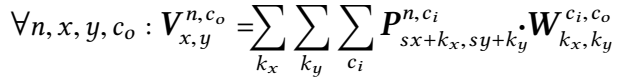
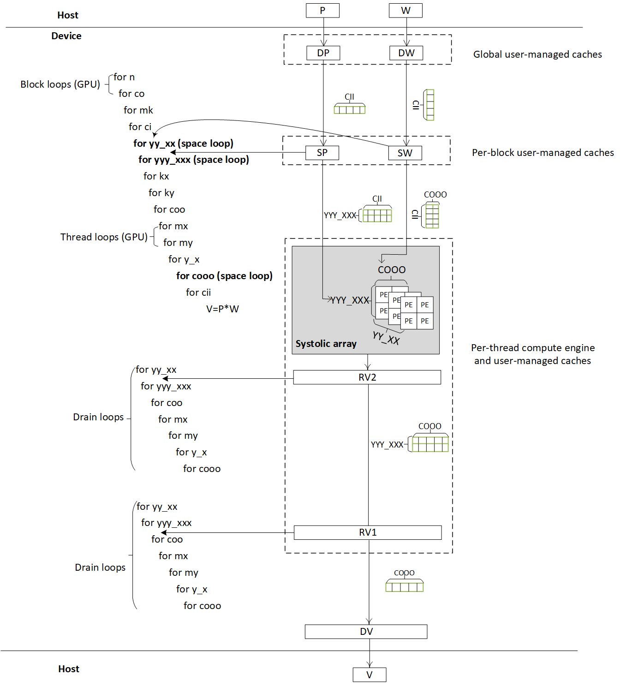

# Capsule convolution

Capsule convolution is defined as follows [1]:

where `s` is the stride, operation `·` is matrix multiplication, and `V`, `P`, and `W` are all 4-dimensional arrays of 4x4 matrices.  In our design, we assume  stride `s=2`.  

## Performance (single precision)

| Device | Frequency | Throughput | Logic utilization | DSP blocks | RAM blocks | Efficiency | Matrix Size | Device compiler |
| ------ | --------- | ---------- | ----------------- | ---------- | ---------- | -----------| ----------- | --------------- |
| Intel Arria 10 GX 1150 | 224 MHz | 568 GFLOPS | 215,444 / 427,200 ( 50 % ) | 1,315 / 1,518 ( 87 % ) | 2,225 / 2,713 ( 82 % ) | 96% DSP efficiency | P(4096,32,15,15,4,4) * W(32,32,3,3,4,4) | aoc 19.4.0 (on s001-n137) |
| Intel Stratix 10 SX 2800 | 219 MHz | 885 GFLOPS | 627,618 / 933,120 ( 67 % ) | 3,584 / 5,760 ( 62 % ) | 4,672 / 11,721 ( 40 % ) | 56% DSP efficiency | P(4096,32,15,15,4,4) * W(32,32,3,3,4,4) | aoc 19.2.0 (on s001-n006) |
| Intel GEN9.5 GPU | 1200 MHz | 398 GFLOPS | - | - | - | 87% machine peak  | P(64,32,15,15,4,4) * W(32,32,3,3,4,4) | CM SDK 20200119 |
| Intel GEN12 GPU | 1650 MHz | 1850 GFLOPS | - | - | - | 73% machine peak  | P(256,2,15,15,4,4) * W(32,32,3,3,4,4) | CM SDK 20211028 |

Note:  when [measuring the performance](../README.md#Performance-metrics),

- Given the above definition of capsule convolution, #operations =  2 * (4 * 4 * 4) * (size of tensor `V` in the equation) * (product of the extents of `kx`, `ky` and `ci` in the equation), where the factor 2 accounts for two operations: multiply and add.
- We reported the maximum throughput for 100 runs on GEN9.5 GPU, as the number largely fluctuated. But we observed it is higher and more stable on our local machine, with the same product model.
- We use different cmc compilers for GEN9.5 and GEN12 GPU, as we find the newer one has limited support for GEN9.5 GPU. The performance is significantly decreased.

## Design

Below is the GPU design. The FPGA design is similar and skipped here.

One may wonder why the drain loops do not contain reduction loops like `kx`, etc. and thread loops like `mx`, etc. This is because the results are already reduced and are drained per thread. 

## [Understand the design](../README.md#how-to-understand-a-design)

## [Test the design](../../../../README.md#Performance-tests)

## References

1. Paul Barham and Michael Isard. Machine learning systems are stuck in a rut. In Proceedings of the Workshop on Hot Topics in Operating Systems, pages 177–183, 2019.  
