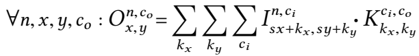
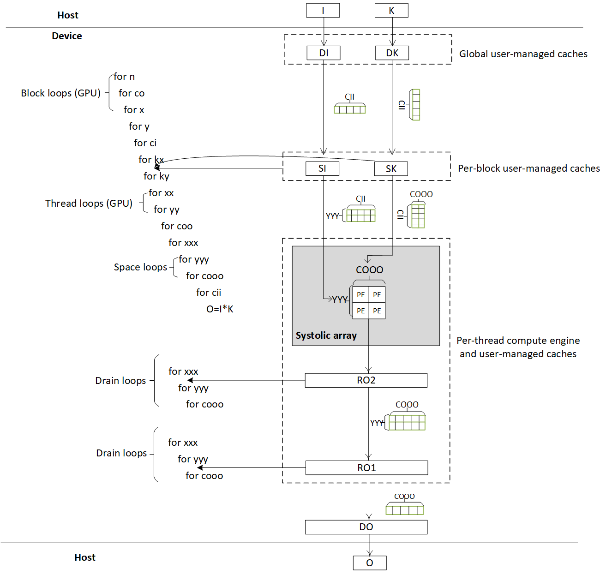

# 2-D convolution

2-D convolution is defined as follows [1]:

 

where `s` is the stride, operation `·` is scalar multiplication, and `O`, `I`, and `K` are all 4-dimensional arrays of scalars.  In this design, we assume  stride `s=1`.  

## Performance (single precision)

| Device | Frequency | Throughput | Logic utilization | DSP blocks | RAM blocks | Efficiency | Matrix Size | Device compiler |
| ------ | --------- | ---------- | ----------------- | ---------- | ---------- | -----------| ----------- | --------------- |
| Intel Arria 10 GX 1150 | 237 MHz | 605 GFLOPS | 205,346 / 427,200 ( 48 % ) | 1,285 / 1,518 ( 85 % ) | 1,366 / 2,713 ( 50 % ) | 99% DSP efficiency | I(64,256,56,56) * K(256,256,3,3) | aoc 19.4.0 (on s001-n138) |
| Intel Stratix 10 SX 2800 | 211 MHz | 1509 GFLOPS | 490,817 / 933,120 ( 53 % ) |3,584 / 5,760 ( 62 % ) | 3,447 / 11,721 ( 29 % ) | 99% DSP efficiency | I(64,256,56,56) * K(256,256,3,3) | aoc 19.2.0 (on s001-n006) |
| Intel GEN9.5 GPU | 1200 MHz | 421 GFLOPS | - | - | - | 92% machine peak  | I(4,256,64,64) * K(256,256,3,3) | CM SDK 20200119 |
| Intel GEN12 GPU | 1650 MHz | 2236 GFLOPS | - | - | - | 88% machine peak  | I(4,256,64,64) * K(256,256,3,3) | CM SDK 20211028 |

Note: when [measuring the performance](../README.md#Performance-metrics),

- Given the above definition of 2-D convolution, #operations =  2 * (size of tensor `O` in the equation) * (multiplication of the extents of `kx`, `ky` and `ci` in the equation), where the factor 2 accounts for two operations: multiply and add.
- We reported the maximum throughput for 100 runs on GEN9.5 GPU, as the number largely fluctuated. But we observed it is higher and more stable on our local machine, with the same product model.
- We use different cmc compilers for GEN9.5 and GEN12 GPU, as we find the newer one has limited support for GEN9.5 GPU. The performance is significantly decreased.

## Design

## [Understand the design](../README.md#how-to-understand-a-design)

## [Test the design](../../../../README.md#Performance-tests)

## References

1. Paul Barham and Michael Isard. Machine learning systems are stuck in a rut. In Proceedings of the Workshop on Hot Topics in Operating Systems, pages 177–183, 2019.  
