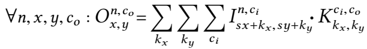

# 2-D convolution

| Device | Frequency | Throughput | Logic utilization | DSPs | BRAMs | Efficiency | Tensor Sizes | Device compiler |
| ------ | --------- | ------ | --------- | ---- | ----- | -------------- | ----- | -------------- |
| Intel Arria 10 GX 1150 FPGA | 206 MHz | 515 GFLOPS | 257,558 / 427,200 ( 60 % ) | 1,299 / 1,518 ( 86 % ) | 2,011 / 2,713 ( 74 % ) | 96%   | 10K * 16K matrix times 16K * 8K matrix | aoc 19.4.0 |
| Intel GEN9.5 GPU | 1200 MHz | 415 GFLOPS | - | - | - | 90%   | 2K * 1K matrix times 1K * 2K matrix | CM Dev Package 20200119 |

Note:

- The DSP efficiency of an FPGA for single-precision matrix multiply equals measured throughput/theoretical peak throughput.
  - Measured throughput in GFLOPS = #operations / execution time =  2 (add + mul) * (#rows of matrix A) * (#columns of matrix A) * (#columns of matrix B) / execution time in nanoseconds.
  - Theoretical peak throughput = 215 MHZ (frequency)  * 2 (add + mul)  * 1518 (#DSPs).
- The machine peak of GEN9.5 for single-precision matrix multiply is calculated as 1200Mhz (peak frequency) * 2 (add + mul) * 2 (FPUs) * 4 (SIMD-4) * 24 (EUs) = 460.8 GFlOPS.  Refer to [GEN architecture document](https://www.intel.com/content/dam/develop/external/us/en/documents/the-compute-architecture-of-intel-processor-graphics-gen9-v1d0.pdf) for more details.

## Design

2-D convolution is defined as follows [1]:



where `s` is the stride, operation `·` is scalar multiplication, and `O`, `I`, and `K` are all 4-dimensional arrays of scalars.   

In this design, the original loops have been manually tiled and ordered. For example, loop `x` has been tiled into an outer loop `x` and an inner loop `xx`, and so on. And we assume stride `s=1`.


 

This design contains several important optimizations:

- Generating a 10x8 systolic array with UREs and a space-time transform
- Generating double buffers for input data, with multiple banks connected as a daisy chain
- Vectorizing input data to utilize the bandwidth of the device's DRAM
- Generating two-level output buffers in registers

The compiler implements the above optimizations. In addition, the compiler automatically performs the following optimizations so that the generated code lends itself to the downstream EDA tools for further optimizations:
- Identifying and rewriting the inner-product pattern
- Moving  channel accesses at the boundaries of the systolic array outside the unrolled loops

## Test the design

This design is specified to compile ahead-of-time (AOT), since AOT mode makes sense for the time-consuming FPGA compilation, although we can slightly change the specification to make it work just-in-time (JIT) as well.

### 1. Run emulation for verifying correctness with a tiny systolic array and inputs:
- Set up the environment in the T2SP directory, if not yet:
    ```
    source ../../../../setenv.sh (local | devcloud)
    ```
- Just to be safe, remove previously generated bitstream and intermediate files, if any:
  
    ```
    rm -rf a.* a/ conv-interface.* *.out exec_time.txt
    ```
- Compile the source code in this directory:
    ```
    g++ conv.cpp -g -I ../util -I $T2S_PATH/Halide/include -L $T2S_PATH/Halide/bin $EMULATOR_LIBHALIDE_TO_LINK -lz -lpthread -ldl -std=c++11 -DTINY
    ```
- Generate a device bitstream for emulation, and a C interface for the host to invoke the matrix multiply kernel in the bitstream:
    ```
    env BITSTREAM=a.aocx AOC_OPTION="$EMULATOR_AOC_OPTION -board=$FPGA_BOARD -emulator-channel-depth-model=strict" ./a.out
    ```
    
     The bitstream generated is `a.aocx`, as indicated by the environment variable, BITSTREAM.  The C interface generated is `conv-interface.cpp`, as specified in `conv.cpp`.
    
- Compile the host file (`conv-run-fpga.cpp`) and link with the C interface (`conv-interface.cpp`):
  
    ```
    g++ conv-run-fpga.cpp conv-interface.cpp ../../../src/AOT-OpenCL-Runtime.cpp ../../../src/SharedUtilsInC.cpp -g -DLINUX -DALTERA_CL -fPIC -I../../../src/ -I $T2S_PATH/Halide/include -I$INTELFPGAOCLSDKROOT/examples_aoc/common/inc $INTELFPGAOCLSDKROOT/examples_aoc/common/src/AOCLUtils/opencl.cpp $INTELFPGAOCLSDKROOT/examples_aoc/common/src/AOCLUtils/options.cpp -I$INTELFPGAOCLSDKROOT/host/include -L$INTELFPGAOCLSDKROOT/linux64/lib -L$AOCL_BOARD_PACKAGE_ROOT/linux64/lib -L$INTELFPGAOCLSDKROOT/host/linux64/lib -lOpenCL -L $T2S_PATH/Halide/bin -lelf $EMULATOR_LIBHALIDE_TO_LINK -lz -lpthread -ldl -std=c++11 -DTINY -o ./b.out
    ```
- Emulate:
    ```
    env BITSTREAM=a.aocx CL_CONTEXT_EMULATOR_DEVICE_INTELFPGA=1 INTEL_FPGA_OCL_PLATFORM_NAME="$EMULATOR_PLATFORM" ./b.out
    ```
### 2. Synthesize and run for performance with a large systolic array and inputs:
- Set up the environment in the T2SP directory, if not yet:
    ```
    source ../../../../setenv.sh (local | devcloud)
    ```
- Just to be safe, remove previously generated bitstream and intermediate files, if any.
  
    ```
    rm -rf a.* a/ conv-interface.* *.out exec_time.txt
    ```
    
- Re-compile the source code with large size:
    ```
    g++ conv.cpp -g -I ../util -I $T2S_PATH/Halide/include -L $T2S_PATH/Halide/bin $HW_LIBHALIDE_TO_LINK -lz -lpthread -ldl -std=c++11
    ```
    
- Generate a device bitstream, and a C interface for the host to invoke the matrix multiply kernel in the bitstream:

    ```
    env BITSTREAM=a.aocx AOC_OPTION="-v -profile -fpc -fp-relaxed -board=$FPGA_BOARD" ./a.out
    ```

    Look for the static analysis report in `a/reports/report.html`. For the options of the `aoc` command, refer to the [Best Practice Guide](https://www.intel.com/content/dam/www/programmable/us/en/pdfs/literature/hb/opencl-sdk/aocl-best-practices-guide.pdf).

    **DevCloud**: This step might take 4-6 hrs. To avoid the above command from being killed automatically by the system, exit your current compute node, and from the headnode `login-2`, submit a batch request. For example,  write a file at your home directory:

    ```
    # file batch.sh
    cd path/to/t2sp
    source setenv.sh devcloud
    cd t2s/tests/performance/conv
    env BITSTREAM=a.aocx AOC_OPTION="-v -profile -fpc -fp-relaxed -board=$FPGA_BOARD" ./a.out
    ```

    Then submit a batch request like this:
    ```
    devcloud_login -b A10PAC 1.2.1 walltime=08:00:00 batch.sh
    ```

    See more details for [how to submit a batch job](https://github.com/intel/FPGA-Devcloud/tree/master/main/Devcloud_Access_Instructions#54-submitting-batch-jobs).

    After the batch job is done, log into a compute node again, and re-source `setenv.sh` (Step 1).   

    **DevCloud A10PAC 1.2.1 only**: further convert the signed bitstream to unsigned:

    ```
    # Type `y` when prompted
    source $AOCL_BOARD_PACKAGE_ROOT/linux64/libexec/sign_aocx.sh -H openssl_manager -i a.aocx -r NULL -k NULL -o a_unsigned.aocx 
    mv a_unsigned.aocx a.aocx
    ```

    For more details, see a [pac_a10 tutorial](https://github.com/intel/FPGA-Devcloud/tree/master/main/QuickStartGuides/OpenCL_Program_PAC_Quickstart/Arria%2010).

- Compile the host file (`conv-run-fpga.cpp`) and link with the C interface (`conv-interface.cpp`):
    ```
    g++ conv-run-fpga.cpp conv-interface.cpp ../../../src/AOT-OpenCL-Runtime.cpp ../../../src/Roofline.cpp ../../../src/SharedUtilsInC.cpp  -g -DLINUX -DALTERA_CL -fPIC -I../../../src/ -I $T2S_PATH/Halide/include -I$INTELFPGAOCLSDKROOT/examples_aoc/common/inc $INTELFPGAOCLSDKROOT/examples_aoc/common/src/AOCLUtils/opencl.cpp $INTELFPGAOCLSDKROOT/examples_aoc/common/src/AOCLUtils/options.cpp -I$INTELFPGAOCLSDKROOT/host/include -L$INTELFPGAOCLSDKROOT/linux64/lib -L$AOCL_BOARD_PACKAGE_ROOT/linux64/lib -L$INTELFPGAOCLSDKROOT/host/linux64/lib -lOpenCL -L $T2S_PATH/Halide/bin -lelf $HW_LIBHALIDE_TO_LINK -lz -lpthread -ldl -std=c++11 -o ./b.out
    ```

- Offload the bitstream to the device.
    ```
    aocl program acl0 a.aocx  
    ```
    
- Run the host binary. The host offloads the bitstream to an FPGA and invokes the matrix multiply kernel there through the interface:
    ```
    env BITSTREAM=a.aocx INTEL_FPGA_OCL_PLATFORM_NAME="$HW_PLATFORM" AOC_OPTION="-board=$FPGA_BOARD" ./b.out
    ```

- Look at the results. With the execution time collected, a roofline model of performance has been automatically generated in a file `roofline.png`.

### 3. [GPU] Run on a GPU
- Set up the environment in the T2SP directory, if not yet:

    ```
    source ../../../../setenv.sh (local | devcloud) gpu
    ```

- Set up your target architecture:

    ```
    export GPU_ARCH=GEN9 # This is for both GEN9 and GEN9.5 GPU
    ```
    or
    ```
    export GPU_ARCH=GEN12
    ```

- Just to be safe, remove previously generated intermediate files, if any.
  
    ```
    rm -rf a.* *.o *.isa CONV_genx.cpp
    ```
    
- Generate a device kernel:

    ```
    g++ conv.cpp -g -I ../util -I $T2S_PATH/Halide/include -L $T2S_PATH/Halide/bin $HW_LIBHALIDE_TO_LINK -lz -lpthread -ldl -std=c++11 -DGPU
    ./a.out
    cmc CONV_genx.cpp -march=$GPU_ARCH -isystem ../../compiler/include_llvm -o CONV_genx.isa
    ```
    The specification is compiled in the first command and is run in the second command, which generates a device kernel file named `CONV_genx.cpp`, which is then compiled into a binary `CONV_genx.isa`.

- Link the host and kernel code and run:
  ```
  g++ conv-run-gpu.cpp -w -g -I$CM_ROOT/runtime/include -I$CM_ROOT/examples -I$CM_ROOT/drivers/media_driver/release/extract/usr/include -msse4.1 -D__LINUX__ -DLINUX -O0 -std=gnu++11 -fPIC -c -DCM_$GPU_ARCH -rdynamic -ffloat-store -o conv-run-gpu.o
  g++ conv-run-gpu.o -L$CM_ROOT/drivers/media_driver/release/extract/usr/lib/x86_64-linux-gnu -L$CM_ROOT/drivers/IGC/extract/usr/local/lib -L$CM_ROOT/drivers/media_driver/release/extract/usr/lib/x86_64-linux-gnu/dri $CM_ROOT/runtime/lib/x64/libigfxcmrt.so -lva -ldl -fPIC -rdynamic -o conv-run-gpu.out
  ./conv-run-gpu.out
  ```

### References

1. Paul Barham and Michael Isard. Machine learning systems are stuck in a rut. In Proceedings of the Workshop on Hot Topics in Operating Systems, pages 177–183, 2019.  