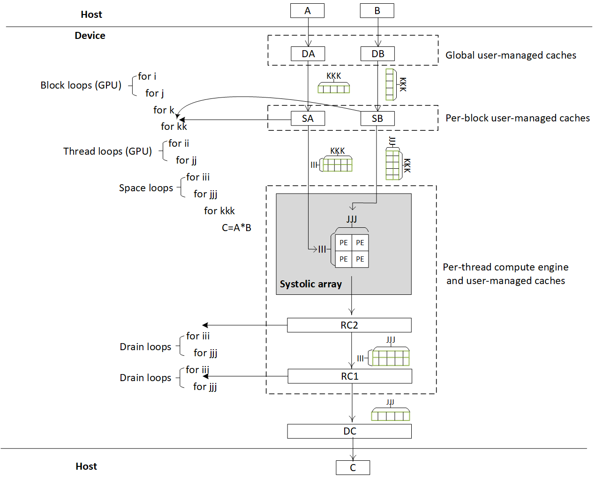

# Matrix Multiply

## Performance (single precision)

| Device | Frequency | Throughput | Logic utilization | DSPs | BRAMs | Efficiency | Matrix Size | Device compiler |
| ------ | --------- | ------ | --------- | ---- | ----- | -------------- | ----- | -------------- |
| Intel Arria 10 GX 1150 FPGA | 215 MHz | 532 GFLOPS | 211,199 / 427,200 ( 49 % ) | 1,304 / 1,518 ( 86 % ) | 2,087 / 2,713 ( 77 % ) | 95% DSP efficiency | 10K * 16K matrix times 16K * 8K matrix | aoc 19.4.0 |
| Intel GEN9.5 GPU | 1200 MHz | 423 GFLOPS | - | - | - | 92% machine peak | 2K * 1K matrix times 1K * 2K matrix | CM Dev Package 20200119 |

Note:

- The DSP efficiency of an FPGA equals measured throughput/theoretical peak throughput with the synthesized clock frequency.
  - Measured throughput in GFLOPS = #operations / execution time in nanoseconds.
  - Given the definition of matrix multiply above, #operations =  2 * (size of matrix `C`) * (extent of `k` in the equation), where the factor 2 accounts for two operations: multiply and add.
  - Theoretical peak throughput = frequency * 2 (multiply and add)  * 1518 (#DSPs).
- The machine peak of GEN9.5 for single-precision computes is calculated as 1200Mhz (the GPU's clock frequency) * 2 (multiply and add) * 2 (FPUs) * 4 (SIMD4) * 24 (EUs) = 460.8 GFlOPS.  Refer to [GEN architecture document](https://www.intel.com/content/dam/develop/external/us/en/documents/the-compute-architecture-of-intel-processor-graphics-gen9-v1d0.pdf) for more details.

## Design

In this design, the original 3 loops are manually tiled and ordered; `III`, `JJJ` and `KKK` are static constants and are the extents of loop `iii`, `jjj`, and `kkk`, respectively. 

On a GPU, some loops are made block loops,  and some loops are made thread loops, to create parallel threads. On an FPGA, there  is only one thread, since multi-threading is not efficient on FPGAs.  To drain results out of the device, we also add extra drain loops for each thread. Any loop that is not specially annotated is a sequential loop.

Data move as the loops run. For matrix `A` and `B` ,  we create abstract memories for them, `DA` and `DB`, that are resident in device DRAM, and serve as global user-managed caches. Above them, we create another level of abstract memories, `SA` and `SB`, that are resident in device SRAM, and serve as per-block user-managed caches.

Each thread contains a systolic array as its compute engine. This systolic array is created with UREs and a space-time transform. After the systolic array finishes execution, its results are drained through two levels of abstract memories, `RC2` and `RC1`,  that are resident in registers, and into the last abstract memory, `DC`, which is on the device's DRAM.

Note that an abstract memory outputs a tensor each time. For example, `DA` outputs a vector of size `KKK` each time. So the abstract memory is named streaming tensor (stensor).   

## [How to test the design](../../../../README.md#Performance-tests)
