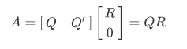

# QR Decomposition

QR decomposition, also named as QR factorization, factors a *`mxn`* matrix A, with *`m≥n`*, as the product of an *`mxn`* orthogonal matrix Q and an *`nxn`* upper triangular matrix R:

## Performance (single precision)

| Device | Frequency | Throughput | Logic utilization | DSP blocks | RAM blocks | Batch Size | Matrix Size | Device compiler |
| ------ | --------- | ------ | --------- | ---- | ----- | ----- | -------------- | -------------- |
| Intel Arria 10 GX 1150 FPGA | 244 MHz | 23.3 K matrices/s | 211,199 / 427,200 ( 49 % ) | 268 / 1,518 ( 18 % ) | 770 / 2,713 ( 28 % ) | 16384 | 128 * 128 matrix | aoc 22.1.0 |

## Design

## [Understand the design](../README.md#how-to-understand-a-design)

## [Test the design](../../../../README.md#Performance-tests)
